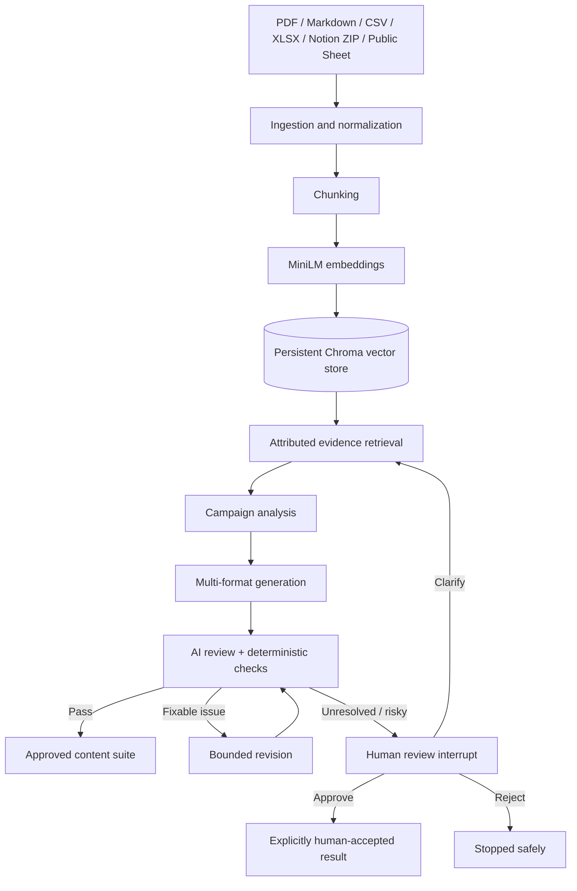

# Evidence-Grounded GTM Content Agent

A stateful AI agent that turns approved product, feature, or event information into a reviewed go-to-market campaign containing a LinkedIn post, promotional email, short blog draft, and multiple ad-copy variations.

The project uses retrieval-augmented generation (RAG) to find relevant facts before writing, LangGraph to coordinate the workflow, Gemini for analysis and content generation, and an independent review stage to check grounding and consistency.

> Current verification: 69 automated tests passing, 94% instrumented core coverage, a successful live Gemini campaign, and a working Streamlit interface.

## Problem statement

Build an agent that accepts a product, feature, or upcoming event and autonomously generates a full go-to-market content suite:

- LinkedIn post
- Promotional email
- Short blog draft
- Ad-copy variations

The agent must ingest a calendar of events or product information from PDF, Google Sheets, or a Notion export. It should store and retrieve relevant context such as launch dates, event information, product specifications, audience details, and past campaign messaging.

Before writing, the agent should understand the product, identify its audience, select an appropriate tone, and develop key campaign messages. A review agent should then critique the generated assets for cross-format consistency, tone alignment, completeness, and factual grounding against the approved sources.

The intended users include product managers, founders, marketing-adjacent teams, consultants, executives, and students building portfolio projects.

## What this implementation delivers

- Ingestion of PDF, TXT, Markdown, CSV, XLSX, public Google Sheets URLs, and Notion Markdown/CSV ZIP exports.
- Persistent semantic retrieval using local MiniLM embeddings and Chroma.
- Attributed evidence with source, passage, chunk, and relevance information.
- Campaign analysis covering audience, tone, value proposition, key messages, rationale, and missing facts.
- Gemini-powered generation of all four required campaign formats.
- At least three distinct ad variations.
- Independent AI review combined with deterministic safety checks.
- Conditional revision and human-review paths.
- Durable SQLite checkpoints that can survive a process restart.
- Streamlit UI, command-line interface, and JSON export.
- Deterministic offline scenarios for repeatable testing without API usage.
- Sample briefs and a complete saved content suite.

## Why this design

### Why RAG instead of sending one large prompt?

Marketing documents frequently contain many unrelated facts. Passing everything to a model makes it harder to identify which claims supported the output and increases the chance of irrelevant or fabricated details.

This project breaks documents into smaller passages, embeds them, and retrieves only passages relevant to the campaign objective. Every returned passage preserves its source ID. The model therefore writes from focused evidence, and a reviewer can trace the generated claims back to approved material.

### Why LangGraph instead of a single model call?

The required workflow contains decisions and loops:

- retrieve evidence before writing;
- stop when evidence is unsafe or insufficient;
- analyze positioning before generation;
- review every generated asset;
- revise a failed review only within a limit;
- pause for a human when automation should not decide;
- preserve state for later resumption.

LangGraph represents these steps as a state machine. This makes routing explicit, testable, bounded, and easier to inspect than a long chain of hidden prompts.

### Why structured model outputs?

Each model response is validated against a Pydantic schema. The model cannot silently return an incomplete content suite or an unknown supervisor action. Invalid output is retried, and persistently invalid routing falls back to a safe deterministic action.

### Why combine AI review with deterministic checks?

An AI reviewer is useful for subjective questions such as tone, audience relevance, and message consistency. Code is better for objective requirements such as:

- whether all formats are present;
- whether at least three ads are distinct;
- whether every asset contains valid source attribution;
- whether verified facts occur in approved evidence.

Combining both methods provides stronger review than relying on either one alone.

### Why local embeddings?

`sentence-transformers/all-MiniLM-L6-v2` is small, fast, and can run locally after its initial download. Retrieval therefore does not consume Gemini tokens, and approved documents do not need to be sent to an embedding API.

### Why keep a deterministic fake provider?

The fake provider is a testing tool, not the production writing experience. It produces predictable results for happy paths, revisions, missing evidence, malformed output, provider failure, and human-review scenarios. Gemini provides the natural marketing copy used in the live demonstration.

## Architecture



### LangGraph flow

```text
START -> initialize -> supervisor
                         |-> retrieve -> supervisor
                         |-> analyze  -> supervisor
                         |-> generate -> supervisor
                         |-> review   -> supervisor
                         |-> revise   -> supervisor
                         |-> human interrupt -> supervisor
                         |-> complete -> END
                         `-> fail -> END
```

The supervisor may select only actions that are legal for the current state. Provider retries, revision attempts, and total graph steps are bounded.

## Technology stack

| Technology | Purpose |
|---|---|
| Python 3.11+ | Application language |
| LangGraph | Stateful workflow, conditional routing, interrupts, and resume |
| Gemini | Campaign analysis, generation, supervision, and qualitative review |
| OpenAI Python SDK | Gemini's OpenAI-compatible structured-output transport and optional OpenAI adapter |
| Pydantic | Strict request, state, content, review, and routing schemas |
| Sentence Transformers | Local MiniLM embedding generation |
| Chroma | Persistent local vector database |
| BM25 | Explicit lexical fallback when vector retrieval is unavailable |
| SQLite | Restart-safe LangGraph checkpoints |
| Streamlit | Browser-based user interface |
| PyPDF | PDF text extraction |
| OpenPyXL | XLSX ingestion |
| Pytest | Unit, integration, routing, provider-contract, and UI acceptance tests |

## Unique strengths

1. **Evidence before content:** generation cannot begin until relevant approved evidence has been retrieved.
2. **Visible attribution:** evidence passages and generated assets retain their source IDs.
3. **Real workflow orchestration:** this is not one large prompt presented as an agent; it has explicit state, legal actions, loops, limits, and interrupts.
4. **Hybrid review:** qualitative model review is reinforced by deterministic completeness and grounding checks.
5. **Safe failure behavior:** missing evidence, contradictory claims, provider errors, invalid actions, and exhausted revisions have tested outcomes.
6. **Human control:** unresolved work pauses for approval, rejection, or factual clarification.
7. **Restart-safe state:** SQLite checkpoints permit a paused CLI workflow to resume in another process.
8. **Offline repeatability:** deterministic provider scenarios allow the complete workflow to be tested without API availability.
9. **Local-first retrieval:** embeddings and the vector store remain local after initial model setup.
10. **Multiple interfaces:** the same core workflow powers Streamlit, CLI execution, JSON export, and automated tests.

## Repository structure

```text
gtm-ai-agent/
|-- examples/                    # Sample briefs, PDF, calendar, and generated suite
|-- docs/                        # Architecture, evaluation, demo, plan, and dev log
|-- scripts/                     # Reproducible test-PDF generator
|-- src/gtm_agent/
|   |-- agents/                  # Supervisor validation and reviewer
|   |-- ingestion/               # File and public Google Sheets ingestion
|   |-- llm/                     # Fake, Gemini, and OpenAI adapters
|   |-- models/                  # Pydantic schemas and workflow state
|   |-- orchestration/           # LangGraph graph and runner
|   |-- retrieval/               # Chunking, MiniLM/Chroma, and BM25 fallback
|   `-- ui/                      # Streamlit application
|-- tests/                       # Automated flow and capability tests
|-- .env.example                 # Safe environment-variable template
|-- pyproject.toml               # Dependencies and package configuration
`-- README.md
```

## Supported input formats

| Input | Support |
|---|---|
| PDF | Text extraction with source attribution |
| TXT / Markdown | Normalized while preserving paragraph boundaries |
| CSV | Header-labelled records |
| XLSX | Sheet names, rows, and labelled cells |
| Public Google Sheet | Validated `docs.google.com/spreadsheets` URL converted to bounded CSV export |
| Notion export | ZIP containing Markdown, TXT, or CSV files |
| Multiple documents | Indexed and retrieved together while retaining individual source IDs |

Public Google Sheets are limited to HTTPS Google spreadsheet URLs and a 5 MB response. Private Sheets and direct Notion workspaces require OAuth or service credentials and are not claimed by this implementation.

## Setup

### Requirements

- Python 3.11, 3.12, or 3.13
- Git
- Internet access for dependency installation and the first embedding-model download
- A Gemini API key for live generation; deterministic scenarios work without a key

### 1. Clone the repository

```powershell
git clone https://github.com/Hari-GenAcad/gtm-ai-agent.git
cd gtm-ai-agent
```

### 2. Create an isolated environment

Windows PowerShell:

```powershell
python -m venv .venv
.\.venv\Scripts\Activate.ps1
python -m pip install --upgrade pip
python -m pip install -e ".[dev,ui]"
python -m pip check
```

macOS or Linux:

```bash
python3 -m venv .venv
source .venv/bin/activate
python -m pip install --upgrade pip
python -m pip install -e ".[dev,ui]"
python -m pip check
```

To keep package and model caches on a specific drive, set these variables before installation or the initial embedding download:

```powershell
$env:PIP_CACHE_DIR = "D:\gtm-ai-agent\.pip-cache"
$env:HF_HOME = "D:\gtm-ai-agent\.models"
```

### 3. Configure environment variables

Copy the template:

```powershell
Copy-Item .env.example .env
```

Add your key to the ignored `.env` file:

```text
GEMINI_API_KEY=your-key-here
GEMINI_MODEL=gemini-3.1-flash-lite
GTM_EMBEDDINGS_LOCAL_ONLY=false
```

Never commit `.env`. It is excluded by `.gitignore`.

`GTM_EMBEDDINGS_LOCAL_ONLY=false` permits the first MiniLM download. After the model is cached, it can be changed to `true` for offline retrieval initialization.

Optional OpenAI configuration:

```text
OPENAI_API_KEY=your-key-here
OPENAI_MODEL=your-supported-model
```

## Run the Streamlit application

With the virtual environment active:

```powershell
python -m streamlit run src\gtm_agent\ui\streamlit_app.py
```

Open [http://localhost:8501](http://localhost:8501).

### Recommended live demo input

Upload [examples/test_product_launch_brief.pdf](examples/test_product_launch_brief.pdf), then use:

| Field | Value |
|---|---|
| Campaign objective | `Create a coordinated launch campaign for LaunchPilot AI that drives qualified B2B SaaS teams to start the 14-day free trial` |
| Target audience | `Product marketing managers, startup founders, and revenue leaders at B2B SaaS companies` |
| Tone | `Clear, confident, practical, and evidence-led` |
| Provider | `Gemini` |

Leave the public Google Sheet field blank for this PDF-only demonstration. The live verified run completed with vector retrieval, two evidence passages, all four formats, three ads, a passing review, zero revisions, and zero errors.

### What the UI displays

- workflow status, revision count, and retrieval mode;
- collapsible retrieved evidence with relevance scores;
- human-readable campaign analysis;
- separate LinkedIn, Email, Blog, and Ads tabs;
- source attribution below each asset;
- review summary, findings, and deterministic checks;
- action-history table;
- JSON download.

## Run from the CLI

### Deterministic offline sample

Audience and tone are omitted here so the agent must infer them:

```powershell
gtm-agent `
  examples\product_brief.md `
  examples\launch_calendar.csv `
  examples\past_campaign.md `
  --objective "Create a coordinated launch campaign for LaunchPad" `
  --scenario review_fail_then_pass `
  --output examples\sample_content_suite.json
```

Expected behavior:

- vector retrieval across three sources;
- campaign audience and tone inference;
- LinkedIn, email, blog, and three ads;
- failed first review;
- one revision;
- passing second review;
- final status `approved`.

See [examples/sample_content_suite.json](examples/sample_content_suite.json) and [examples/SAMPLE_OUTPUT.md](examples/SAMPLE_OUTPUT.md).

### Live Gemini run

```powershell
gtm-agent examples\test_product_launch_brief.pdf `
  --objective "Create a coordinated launch campaign for LaunchPilot AI that drives qualified B2B SaaS teams to start the 14-day free trial" `
  --audience "Product marketing managers, startup founders, and revenue leaders at B2B SaaS companies" `
  --tone "Clear, confident, practical, and evidence-led" `
  --provider gemini `
  --output launchpilot-suite.json
```

### Public Google Sheet

The sheet must be publicly readable:

```powershell
gtm-agent `
  --google-sheet "https://docs.google.com/spreadsheets/d/SHEET_ID/edit#gid=0" `
  --objective "Create a campaign for the upcoming launch" `
  --provider gemini
```

## Human review and durable resume

Start a durable run with a stable thread ID:

```powershell
gtm-agent examples\product_brief.md `
  --objective "Launch LaunchPad" `
  --scenario review_always_fails `
  --checkpoint-db .gtm-checkpoints.sqlite `
  --thread-id demo-1
```

If the process stops while waiting for human review, resume it from another process:

```powershell
gtm-agent `
  --checkpoint-db .gtm-checkpoints.sqlite `
  --resume-thread demo-1 `
  --human-response approve
```

Human outcomes remain explicit:

- **Approve:** accepts the flagged draft but does not mislabel it as automated approval.
- **Reject:** stops the workflow safely.
- **Clarify:** appends approved factual context, clears derived content, and returns to retrieval.

## Deterministic test scenarios

| Scenario | Purpose |
|---|---|
| `happy` | Direct successful workflow |
| `review_fail_then_pass` | Review, revision, second review, approval |
| `review_always_fails` | Revision limit and human interrupt |
| `missing_evidence` | Evidence safety gate |
| `malformed_output` | Structured-output retry and safe failure |
| `provider_failure` | Provider retry exhaustion |
| `invalid_supervisor_action` | Illegal routing rejection and recovery |

The fake provider is selected by default and does not make network calls.

## Testing and verification

Run all tests:

```powershell
python -m pytest
```

Run coverage:

```powershell
python -m pytest --cov=gtm_agent --cov-report=term-missing
```

Latest verified results:

- **69 passed, 0 failed**
- **94% instrumented core coverage**
- **96% orchestration coverage**
- `pip check`: no broken requirements in the clean environment
- successful local MiniLM semantic retrieval
- persistent Chroma reuse
- SQLite close/reopen and cross-run resume
- complete Streamlit upload-to-approved flow
- successful live Gemini generation and review

Streamlit's `AppTest` uses a separate script runner, so its passing end-to-end UI test is reported separately from parent-process line coverage.

For the detailed evidence matrix, see [docs/EVALUATION.md](docs/EVALUATION.md).

## Error handling

The workflow handles:

- provider connection and capacity failures;
- malformed structured model responses;
- illegal supervisor actions;
- missing or irrelevant evidence;
- selected contradictory launch facts;
- unsupported guarantees and superlatives;
- revision exhaustion;
- total step-limit exhaustion;
- explicit human rejection.

Gemini calls use an explicit timeout and no hidden SDK retries. Retry policy remains visible and bounded inside the graph.

## Troubleshooting

### `GEMINI_API_KEY is required`

Create `.env` from `.env.example`, add the key, and restart Streamlit.

### Gemini reports a connection error

- Confirm the machine and process have outbound HTTPS access.
- Check that the key is active and the configured model is available.
- Restart Streamlit after editing `.env`.
- Temporary free-tier capacity errors may require another attempt.

### Embeddings fall back to BM25

For the first run, set:

```text
GTM_EMBEDDINGS_LOCAL_ONLY=false
```

After `all-MiniLM-L6-v2` is cached, change it back to `true` if offline startup is preferred.

### Port 8501 is already in use

Start Streamlit on another port:

```powershell
python -m streamlit run src\gtm_agent\ui\streamlit_app.py --server.port 8502
```

### A workflow pauses instead of approving

Open the Review tab. The agent may be correctly requesting human judgment because evidence is missing, contradictory, risky, or still unresolved after bounded revisions.

## Security and privacy boundaries

- API keys are read from environment variables and `.env` is ignored.
- No credentials are stored in generated workflow state or committed examples.
- Arbitrary URL ingestion is rejected; direct URL ingestion is restricted to public HTTPS Google Sheets.
- Uploaded material is embedded into a local Chroma store.
- The deterministic provider never accesses the network.
- Content is not automatically published to external platforms.
- Human acceptance of a failed automated review remains visibly labelled as such.

If a key is accidentally shared publicly, revoke and rotate it immediately.

## Known limitations

- Private Google Sheets and direct Notion API connections require OAuth/service-account work not included here.
- Product research is limited to user-approved source documents rather than unrestricted web research.
- Evidence-risk detection covers selected structured contradictions and risky wording, not every possible semantic conflict.
- After a complete Streamlit server restart, durable thread recovery currently uses the CLI resume interface.
- Content remains ready to edit; human brand and legal review is still recommended before publication.
- External publishing and production deployment are outside the project scope.

## Documentation

- [Architecture](docs/ARCHITECTURE.md)
- [Evaluation report](docs/EVALUATION.md)
- [Demo script](docs/DEMO_SCRIPT.md)
- [Implementation plan](docs/IMPLEMENTATION_PLAN.md)
- [Development log](docs/DEVLOG.md)

## License

No license has been added. All rights remain with the repository owner unless a license is added later.
